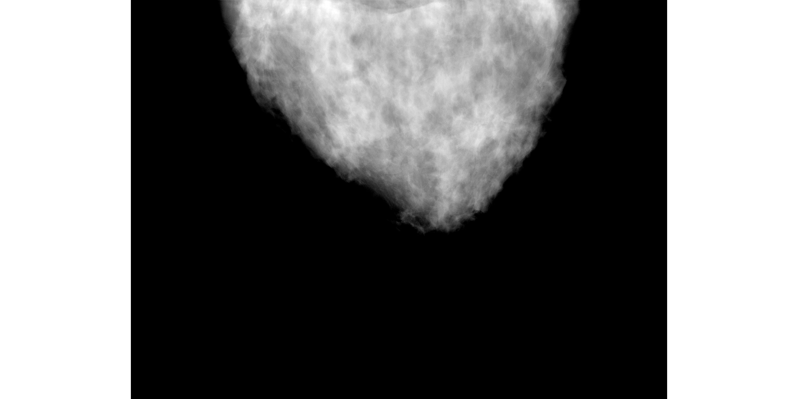

**MCGPU** is an open-source x-ray imaging simulation software intended to generate virtual x-ray projections of computational anatomical models described by voxels.
This software was created, and is actively under development, at [FDA](https://www.fda.gov)/[CDRH](https://www.fda.gov/Medical-Devices)/[OSEL](https://www.fda.gov/about-fda/cdrh-offices/office-science-and-engineering-laboratories)/[DIDSR](https://www.fda.gov/about-fda/cdrh-offices/division-imaging-diagnostics-and-software-reliability). 

MCGPU can replicate any radiographic or computed tomography device (with different levels of realism depending on the device characteristics). 
The latest update to the code, called VICTRE_MCGPU in this repository, enables the realistic replication of mammography systems and the acquisition of digital breast tomosynthesis (DBT) scans. The original version of the software is still available at https://github.com/DIDSR/MCGPU.

A peer-reviewed, open-access article describing the VICTRE_MCGPU software has been published, and we would appreciate it if you cite this work in your own publications using the software:

 - _Andreu Badal, Diksha Sharma, Christian G. Graff, Rongping Zeng, and Aldo Badano, Mammography and breast tomosynthesis simulator for virtual clinical trials, 
Computer Physics Communications 261, p. 107779 (2021)_
https://doi.org/10.1016/j.cpc.2020.107779

A key publication describing the use of MCGPU in the VICTRE virtual imaging clinical trial is also available, and provides essential information to understand the purpose and capabilities of this software project:

 - _Aldo Badano, Christian G. Graff, Andreu Badal, Diksha Sharma, Rongping Zeng, Frank W. Samuelson, Stephen J. Glick, Kyle J. Myers, 
Evaluation of Digital Breast Tomosynthesis as Replacement of Full-Field Digital Mammography Using an In Silico Imaging Trial,
JAMA Network Open 7, p. e185474 (2018)_
https://doi:10.1001/jamanetworkopen.2018.5474

For a simplified method to run this software and the rest of the VICTRE tools, check the Python class in this new repository from our group:
https://github.com/DIDSR/VICTRE_PIPELINE

## Disclaimer

This software and documentation (the "Software") were developed at the Food and Drug Administration (FDA) by employees of the Federal Government in the course of their official duties. Pursuant to Title 17, Section 105 of the United States Code, this work is not subject to copyright protection and is in the public domain. Permission is hereby granted, free of charge, to any person obtaining a copy of the Software, to deal in the Software without restriction, including without limitation the rights to use, copy, modify, merge, publish, distribute, sublicense, or sell copies of the Software or derivatives, and to permit persons to whom the Software is furnished to do so. FDA assumes no responsibility whatsoever for use by other parties of the Software, its source code, documentation or compiled executables, and makes no guarantees, expressed or implied, about its quality, reliability, or any other characteristic. Further, use of this code in no way implies endorsement by the FDA or confers any advantage in regulatory decisions. Although this software can be redistributed and/or modified freely, we ask that any derivative works bear some notice that they are derived from it, and any modified versions bear some notice that they have been modified.

# MC-GPU_v1.5b: VICTRE pivotal study simulations

The version of MC-GPU in this repository was developed  to replicate as realistically as possible a Siemens Mammomat Inspiration system for the Virtual Imaging Clinical Trial for Regulatory Evaluation (VICTRE) project.
This code was used in the VICTRE pivotal study simulations executed in February 2018.

The software is designed to simulate full-field digital mammography images and digital breast tomosynthesis (DBT) scans of the computational breast phantoms created by [Christian Graff's software](https://github.com/DIDSR/BreastPhantom).
Some of the improvements implemented in this version of MC-GPU compared to previous versions (https://github.com/DIDSR/MCGPU) are:
- DBT acquisition geometry.
- Extended focal spot model.
- Optional focal spot motion.
- Optional anti-scatter grid model.
- Amorphous Selenium direct detector model: depth of interaction, fluorescence escape, charge generation, Swank factor, electronic noise.
- Voxelized phantoms stored in memory usig a binary tree structure to save memory.
- Old version limitation: material densities hardcoded for Graff's phantom composition. *New version: new input file allows user-defined materials and densities.*

## Compilation instructions
The compilation of the MCGPU simulator can be easily accomplished by executing the provided Makefile.
However, you might need to edit the script before compilation to provide the correct paths to the needed libraries in your operating system, and your target GPU compute capability.
The only external dependencies of the software, in addition to a functioning version of the NVIDIA/CUDA SDK, are the openMPI and GZip libraries.

## [Example simulation](example_simulations/README.md)
Simulation input files, and auxiliary files, have been added in the [example_simulations folder](https://github.com/DIDSR/VICTRE_MCGPU/tree/master/example_simulations) to allow the replication of two of the simulations of the VICTRE project.
A breast phantom with scattered glandularity and a heterogeneously dense phantom created with C. Graff model are provided (these phantoms were not part of the original VICTRE pivotal study, and have a single large mass embedded inside). The material files (generated from PENELOPE 2006 material files) and energy spectra used in the simulations are included.

## Description of the Monte Carlo simulation algorithm

This section describes some of the models implemented in the version of the GPU-accelerated Monte Carlo (MC) x-ray transport simulation code MC-GPU used in the VICTRE project, and lists some of the most relevant limitations. 
This documentation is based on the contents of a scientific publication under development, and will be updated when the publication is submitted (I apologize for the missing references).

The MC x-ray transport simulation code MC-GPU\cite{badal2006} was adapted to replicate the technical specifications and operation of an imaging device in clinical use for mammography and DBT.
The software uses the well known x-ray--matter interaction physics and material-specific interaction cross sections from PENELOPE 2006\cite{salvat2006}.
In each simulation, a large number of x-ray tracks are simulated from the source to the detector through the patient, and the average amount of energy deposited in each tissue of the patient and the average signal created in each pixel of the detector are tallied.
Since each x-ray track is independent from the others, MC-GPU simulates the tracks in parallel in the thousands of computational cores of a Graphics Processing Unit (GPU) using the CUDA library (NVIDIA Corp., Santa Clara, CA, USA). 
Multiple GPUs in one or more computers can also be used concurrently in the same simulation, and the final results are gathered in a single output using the Message Passing Interface library functions.

The guiding principle that was followed in the development of the MC-GPU software was to implement models as realistic as possible from basic physical principles, without using fitting parameters or approximations that could compromise the validity of the simulation results or unnecessarily restrict its context of use.
In comparison to alternative x-ray imaging modeling methods, such as simple ray-tracing with exponential attenuation, the Monte Carlo algorithm readily simulates the primary beam and scattering contributions to the images, quantum noise, extended focal spot, patient dose, depth-of-interaction effects in the detector response at angular incidence, and other relevant phenomena.
   
The main extensions and modifications of MC-GPU implemented to reproduce the breast imaging system are described in the following sub-sections. 
A detailed list of simplifications and approximations in the implemented models is provided in the last sub-section.

### (a) Source model
The reproduced clinical x-ray source has a focal spot with a nominal size of 300 $\mu$m. 
To model this extended source, the emission point of the x-rays is randomly sampled at a distance from the user-input source position following a 3D Gaussian probability distribution with 300 $\mu$m full width at half maximum size, cropped at 2 standard deviations to preserve the focus sharpness.
The shape of the original focal spot is not a symmetric 3D Gaussian, but we consider that this model provides a good first approximation when the real shape is unknown.

For each one of the 25 view of the reproduced Siemens acquisition protocol, the focal spot center is rotated at the required angle ($\pm$25$^{o}$) around the system rotation axis to truthfully reproduce the geometry of the wide angle DBT trajectory, while the detector remains in a fixed position below the compressed breast.
To model the blur in the images caused by the source motion in the continuous acquisition scans, the sampled emission points are randomly spread along a 0.18 degree arc around the rotation axis, to reproduce a 90 ms exposure time as reported by Mackenzie et al.\cite{Mackenzie2017}

The initial direction of the x-ray is uniformly sampled within a right-angled pyramid determined by two user-defined aperture angles.
The aperture angles reproduce two ideal orthogonal collimators, and generate a rectangular projection field-of-view on the detector plane.
The collimation of the x rays in a right-angled pyramid with the pyramid's vertex (focal spot) and central axis aligned with the patient's chest wall, instead of a standard pyramid or a cone beam, is a common characteristic of breast imaging devices.

The x-ray energy spectrum, after filtration, is sampled from a pre-computed ([see online tool for the simulation of x-ray spectra](https://www.oem-products.siemens-healthineers.com/x-ray-spectra-simulation)). 
probability distribution function corresponding to a 28 kVp Tungsten anode source (or 30 kVp for the thickest breasts) with a 50 $\mu$m Rhodium filter and a 1 mm Beryllium window.\cite{Boone1997}. 

### (b) Detector model    
The original ideal detector model in MC-GPU has been extended to reproduces a 200-$\mu$m-thick amorphous Selenium (Se) direct conversion detector\cite{Kasap2011}, with 3000x1500 85 $\mu$m pixels (the real detector has 3584x2816 pixels, but the smaller image grid was sufficient to cover the largest breast phantoms we generated).
The detector includes a 1-mm-thick protective cover and an optional 1D focused antiscatter grid simulated using the analytical model from Day and Dance.\cite{Day1983}
The grid is defined with a frequency of 31 line pairs/cm and grid ratio of 5.
Not knowing the exact composition of the grid, 65 $\mu$m lead strips and polystyrene interspace material were assumed.
A binary random sampling determines if the x-ray is absorbed or transmitted through the cover and the grid.

X-rays entering the detector are tracked until their first photoelectric interaction to reproduce the detector detection efficiency (some x-rays might cross the Se layer without interaction), and to reproduce the geometric distortion of the point spread function due to oblique incidence (especially important in DBT acquisitions).
For x-ray with energy above the Se k-edge, a fluorescence emission is randomly sampled according to the fluorescence yield probability.
The fluorescence photon is emitted in a random direction and tracked to its first interaction.
The energy of the photons is locally deposited in the pixels covering their interaction locations.
The sharing of the incident energy in re-absorbed fluorescence will cause a correlation of the signal in neighboring pixels.

The deposited photon energy is converted into detected charge in the pixel by sampling a Gaussian distribution with the mean value corresponding to the charge generated with an effective detector gain (W+) of 50~eV per detected electron-hole-pair\cite{Zhao1997} and a standard deviation given by a Swank factor of 0.99.\cite{Zhao1997}
At the end of the simulation, a Poisson distributed random sample with a mean value of 5200 charges is added to each pixel value to reproduce the additive electronic noise.\cite{Zhou2007}
The final units of the simulated image are charges (detected electron hole pairs), and are tallied as 32-bit floating point values.
A post-processing step can be performed to transform the images to the units output by the real detector analog-to-digital converter in 13-bit integer, taking into account the different electronic gain used at the mammography and DBT exposures.
Comparing the sensitometric response of the real and simulated detector, we estimated that the conversion factor from the simulated units to the real units (after subtraction of the mean dark field image) was 0.000239 for mammography, and 0.001469 for DBT. 
The transformed pixel values have to be offset by 50 units and truncated to 13 bits integers.
Optionally, the simulated pixel values can be offset an extra factor 8 and truncated to 16 bits to preserve more fine details.
Example simulated mammography and DBT images from the VICTRE trial, transformed into 16 bits, can be downloaded at the [website of The Cancer Imaging Archive](https://dx.doi.org/10.7937/TCIA.2019.ho23nxaw).
    
    
### (c) Patient and x-ray tracking models
MC-GPU uses a voxelized geometry model to represent the patient anatomy. 
The transport of the x rays across the voxelized volume is accomplished using a delta scattering tracking algorithm.\cite{badal2006}
Delta scattering adds virtual interactions in the x-ray path to force it to interact in every material as much as in the most attenuating material in the geometry (at the current energy).
The x ray is transported from its current position to the randomly sampled position of the next interaction in a straight line without calculating the intersections between the x-ray path and the voxel boundaries. 
The interaction probabilities of the material at the interaction point are used to sample if the interaction is elastic, inelastic, photoelectric, or virtual.
Virtual interactions do not modify the direction or energy of the x ray.
Since many voxels can be jumped in a single step, the voxel size does not affect the simulation time, and very high resolution voxelized phantoms can be used without losing computational performance.
High resolution phantoms, such as the mathematically defined model created by Graff\cite{Graff2016} that we used in the examples shown in this article, are particularly beneficial in breast imaging because tiny microcalcifications can be modeled in detail.
A negative effect of the delta scattering algorithm is that including small high-density objects in the phantom, such as metal implants, can substantially slow down the simulation due to the increase in the amount of virtual interactions.

The limited amount of memory available in the GPUs sets an upper bound to the size (and resolution) of the voxelized phantoms that can be used in the simulations.
We observed that large fatty breasts voxelized at 50$\mu$m did not fit in the 8 GByte of memory of the NVIDIA GeForce GTX 1080 cards we intended to use in our simulations.
To reduce the memory required to store the voxelized phantom in GPU memory, without affecting the geometric accuracy, we stored the voxel data in memory as a binary tree structure as described by Badal and Badano.\cite{Badal2019} 
The binary tree reduced the memory burden more than 90\% in our simulations due to the fact that large regions of the phantom shared the same composition (air outside the breast, for example), and therefore it was possible to combine thousands of consecutive identical voxels into a shared binary tree branch.
    

### (d) Number of x-rays modeled per image
An essential parameter in any MC simulation is the number of histories (x-ray tracks) that need to be sampled. 
This is important because the simulation time and the uncertainty in the estimated quantities of interest are directly proportional to the number of histories. 
A common approach to determine that sufficient histories have been simulated consists in tallying the statistical uncertainty in the results and stopping the simulation whenever the uncertainty in the results becomes lower than a predetermined value. 
However, when we are estimating the values of pixels in an image it is possible to take advantage of the analogy between the MC sampling uncertainty and quantum noise, which is the intrinsic variance in the pixel values in a radiographic image caused by the finite number of photons detected at each pixel.
Matching the number of histories in a simulation with the number of x-rays in a real acquisition, and avoiding the use of variance reduction techniques, produces images with a pixel variance comparable to the quantum noise in the real images.
In addition, the organ dose in the examination is directly estimated in absolute units (mGy) without the need for a scaling factor.

The method we used to determine the number of x-ray tracks to simulate in a mammogram was based on a conversion factor relating the output of the real x-ray source (in terms of air kerma at 1 m) and the number of histories.
Experimental measurements of the energy spectra and mAs selected by the automatic exposure control (AEC) system for different breast thicknesses, and air kerma per mAs output by the x-ray source, were published in the National Health System Cancer Screening Program equipment report 1306\cite{NHSreport1306}.
Corresponding air kerma per history values for each energy spectra were simulated using the MC code with a geometry composed of only air voxels. 
As a basic model for an ideal ionization chamber, the air kerma measurement was assumed to be equal to the average energy deposited in a 2x2x2 mm^3 air volume at 1 m from the source.
The ratio between the experimental and simulated air kerma values provided the conversion factors of number of histories per mAs.
For example, at 30 kVp the real source exposure is 14.7 $\mu$Gy/mAs, and the simulated source exposure is 3.7e-9 $\mu$Gy/history, which corresponds to 4.0e9 histories/mAs.
For the 5.5-cm-thick scattered glandularity breast, the AEC reportedly uses 85.1 mAs for a total of 3.4e11 histories to be simulated.

The average glandular dose in a mammogram generated by the measured AEC output is of the order of 1 mGy. 
We assumed that for the 25 views in a DBT acquisition, the device would use 50% more exposure than in a single mammogram (50% more x rays).
The total number of x rays was equally distributed amongst all the views, producing an expected mean dose of the order of 1.5 mGy.

### (e) Model assumptions and simplifications
Even though we intended to model the clinical device as realistically as possible, some simplifications of the physics models were required in order to increase the simulation speed and enable the simulation of thousands of virtual patients in a reasonable time (less than 1 hour per patient, for example).
Some assumptions were also required to model parts of the device that have not been publicly disclosed by the manufacturer and that have not been characterised by independent researchers in the bibliography.
The most relevant simplifications implemented in the software are the following:

  * No secondary electron transport after photoelectric or Compton interactions: assuming that the electrons are locally absorbed at the site of interaction (consistent with a range <20$\mu$m for 30 keV electrons in water).
  * No fluorescence emission inside the body; only K$_{\alpha}$ fluorescence emitted and tracked inside the Se detector.
  * X-ray energy spectrum sampled from a probability distribution function; same spectrum emitted at every angle (no heel effect).
  * Ideal beam collimators (scatter and transmission through the collimators not considered).
  * Simplified interaction modeling inside the detector and antiscatter grid (no Compton scattering).
  * No electron--hole transport inside the Se detector; no charge sharing between pixels (typical charge drift in the Se detector is of the order of 10$\mu$m). 

The following assumptions were implemented in the models for lack of detailed knowledge of the parameters in the real devices:

  * 3D-Gaussian (symmetrical) extended focal spot; no off-focus radiation.
  * No semiconductor inner structure: no blocking (insensitive) layer at the top and bottom sides of the detector.
  * No temporal effects on the detector response such as lag or ghosting\cite{Zhao2005} (note that it has been reported that the clinical device automatically attempts to compensate for these temporal effects with an undisclosed post-processing step\cite{Mackenzie2017}).
  * No structured or fixed pattern noise\cite{Monnin2014} in the images (all pixels have the same sensitivity and gain; no dead pixels).
  * Approximate thickness and composition of the antiscatter grid interspace (polystyrene) and strips (lead).
  * Simple additive electronic noise\cite{Monnin2014}, without detailed model of the pixel charge read-out electronics.
  * No image post-processing (using only raw images for-processing not for-presentation).
  * Number of x-rays for each breast glandularity estimated using AEC output measured with uniform phantoms with equivalent thickness, neglecting the correlation between thickness and glandularity.
  * Same source motion blur (i.e., same exposure time) assumed for all exposure settings.
  * No patient motion during image acquisition.

## Material density and voxel id table 
The original VICTRE code used a hard-coded conversion table to assign a material to a specific voxel id number, and a fixed density for each material.
The code has been upgraded to allow the user to choose the density and voxel id for each material listed in the input file. 
To do this, after each material file names add the keyword 'density=' and the desired material density (if no density is given, the nominal material density written in the material file is used). 
You can also use the keyword 'voxelID=' to provide a comma-separated list of voxel id numbers.
The voxels in the input geometry with the given id will be assigned to the corresponding material.
See the input file "MC-GPU_v1.5b_sample_mammo_and_DBT_simulation_InputDensity.in" for an example.

If no density and voxel id are input, the software automatically defaults to the same values used in the VICTRE project.
THe new code is 100% compatible with the old input files, and the change has no effect on the simulation results.

# KNOWN AND NEW ISSUES

Feel free to **report any bug, unexpected simulation results, or suggest new features by creating a new "Issue" in the Issues tab** above. Please provide your affiliation and details on the application you are simulating with the issue. Note that we do not have the resources to address all the requests. In particular, we might not be able to help with compilation errors in new versions of Ubuntu or other untested operating systems (but the program should eventually compile in any architecture with enough effort).

We are happy to know how our software is being used. **Please send us an email** (or create an issue) **if you write an interesting article or dissertation using some of our tools.**

We are aware of the following issues with the software (might be addressed in future versions):

1. A faint vertical line might appear at the center of some very long simulations, or with very long source-to-detector distances. This seems to be caused by the finite resolution in sampling and storing the x-ray direction near 0 degrees with the GPU single precision arithmetic.
    
2. If the number of voxels in your phantom exceeds 2^31 (~2e9), please enable the BINARY TREE option in the input file to avoid overflow of the voxel pointer in the GPU, which produces a projection image with the phantom split in half.
