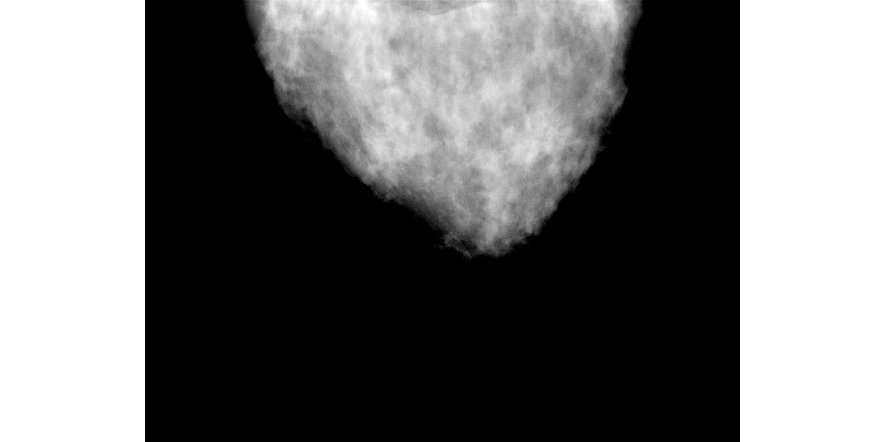

## Example simulation

Input files for four example simulations with two breast phantoms, one with scattered glandularity (scattered) and the other heterogeneously dense (hetero) are provided. 
These phantoms were created with [C. Graff model](https://github.com/DIDSR/breastPhantom), and have a large mass embedded inside.
Two of the input files (named "fast"), intended to get results quickly (around 5 minutes), simulate a mammogram of the phantom with 1% of the number x-rays in a regular examination. 
The other two input files (named "mammo+DBT") simulate, in a single execution, a full dose mammogram and a DBT scan with 25 individual projections (all projections together use 50% more x rays than the mammogram alone).
Note that the simulations with the scattered glandularity phantom will take substantially longer due to the larger thickness and increased field of view (more of the detector being irradiated, requiring more x-ray tracks).

The material files (generated from PENELOPE 2006 material files), energy spectra files, phantom data, and sample results and output files are provided in the sub-folders.
A compiled executable file (Ubuntu 16.04.6 LTS, CUDA-9.0) and example results and output files simulated in a NVIDIA GeForce GTX TITAN X card are provided in the results folder.

To compile the source code, run the simulation, and visualize the out image, execute:

```bash
sh make_MC-GPU_v1.5b.sh
time ./MC-GPU_v1.5b.x MC-GPU_v1.5b_scattered_phantom_mammo_fast.in | tee MC-GPU_v1.5b_scattered_phantom_mammo_fast.out 
imagej results/mcgpu_image_22183101_scattered_mammo.raw &
```
The output images are stored in raw format with one floating point value per pixel. They can be imported into imagej using: Image type: 32-bit real; width: 3000 pixels; height: 1500 pixels; Number of Images: 1 or 2; white is zero; Little-endian byte order. Note that each image output file actually contains two images. The first image shows the expected image in a real detector with both scatter and primary radiation. The second image shows only the primary (non-scattered) x rays contribution, as if there were a perfect antiscatter grid in the system (subtracting both images you can see the total scatter contribution). 

To visualize or reconstruct a DBT dataset, it is convenient to extract all the primary+scatter images in the acquisition and combine them in a single file. The simple utility _extract_projections.c_ is provided to extract each first image in a set of projections, and combine them in a single file.
```bash
gcc extract_projections.c -O -o extract_projections.x
./extract_projections.x 3000 1500 25 1 mcgpu_image_22183101_scattered
```

If multiple GPUs are available in the current computer, the simulation will be able to use them in parallel using MPI communications (if the GPUs are in different computers, add the options "-x LD_LIBRARY_PATH -hostfile my_hostfile.txt"). To execute the simulation in parallel in 4 GPUs, use the command:
```bash
mpirun -n 4 /path/MC-GPU_v1.5b.x /path/MC-GPU_v1.5b_scattered_phantom_mammo_fast.in | tee /path/MC-GPU_v1.5b_scattered_phantom_mammo_fast.out
```
When simulating the mammography and DBT scans in the same simulation, the mammogram will be output in the file number "0000". The image ending in "0013" corresponds to the center (0 degree) of the DBT scan, and has the exact same view of the phantom as the mammogram but with much lower exposure, more scatter (no grid) and motion blur. 
A visualization of file "mcgpu_image_15087760_hetero_0000.raw" (imageJ with the appropriate window and level scale) is provided below. 
A visualization of the scatter component in the image is also provided. 
This image is generated subtracting the second image in the .raw file (primary only) from the first image.
It can be seen that the scatter (a small fraction of the primary transmission) transmits only in the vertical direction, which corresponds to the orientation of the antiscatter grid lines.
A video of the 25 DBT projections is included in the results folder. 




Visualizing the output with a wide grayscale window and level, you can identify different exposure regions in the image, labeled below.
The compression plate and breast support can be seen in the image because they are included in the voxelized geometry and are only as large as the phantom (in a real system they would cover the entire detector).


The average radiation dose deposited in the glandular tissue of the phantom is reported in the table in section "MATERIALS TOTAL DOSE TALLY REPORT" of the output file.
In the scatter phantom simulation, the 4th column/6th row of the table reports a glandular dose of 0.90442 mGy for the mammogram, and 1.32413 mGy for the 25 projections of the DBT scan.
This simulation had a runtime of 2 hours in a NVIDIA GeForce GTX TITAN X card (123 million x-rays/s).


